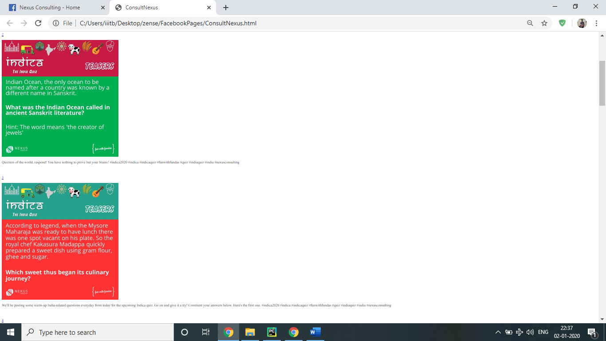

# ScrapeFacebook
Made using Python, Selenium and BeautifulSoup for Zense. Please read [report.pdf](/report.pdf) for more details. 

## Installation
- Selenium: `pip install selenium`
- Relevant browser driver from [here](https://selenium-python.readthedocs.io/installation.html#drivers)
- BeautifulSoup: `pip install beautifulsoup4`
- lxml: `pip install lxml`

## Configuration
- Input the pages you want to scrape in the list called pages.
- Setup environment variable for browser driver or mention the path explicitly while creating the object as `webdriver.Chrome (“path”)`.
- Enter path to your favorite webbrowser using `webbrowser.get`. 

## Screenshot

